# Yande.re Spider Next

基于 FastAPI + Vue3 的 yande.re **图片下载管理工具**，支持图片批量下载、标签管理、本地浏览等功能。

## 功能预览

<details>
<summary>点击展开查看截图</summary>

| 首页瀑布流 | NSFW模式 | 暗黑模式 |
|:---:|:---:|:---:|
| 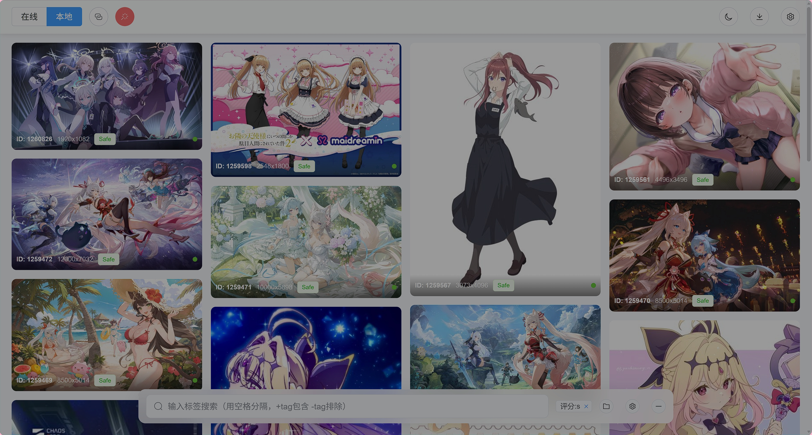 | 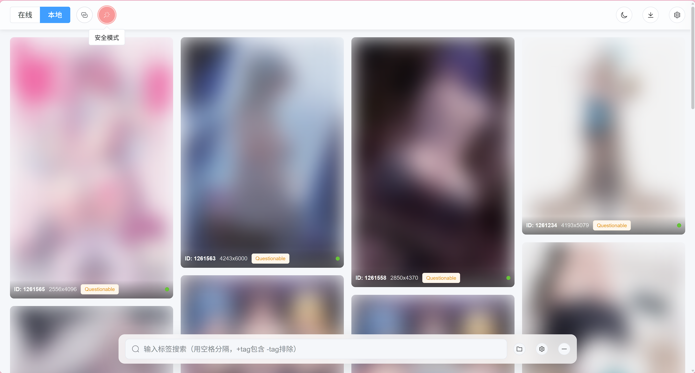 | 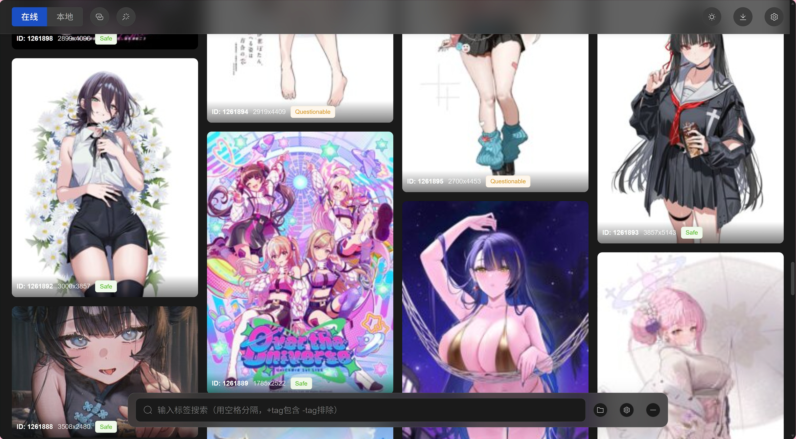 |

| 详情页 | 标签分类 | 标签缓存 |
|:---:|:---:|:---:|
| 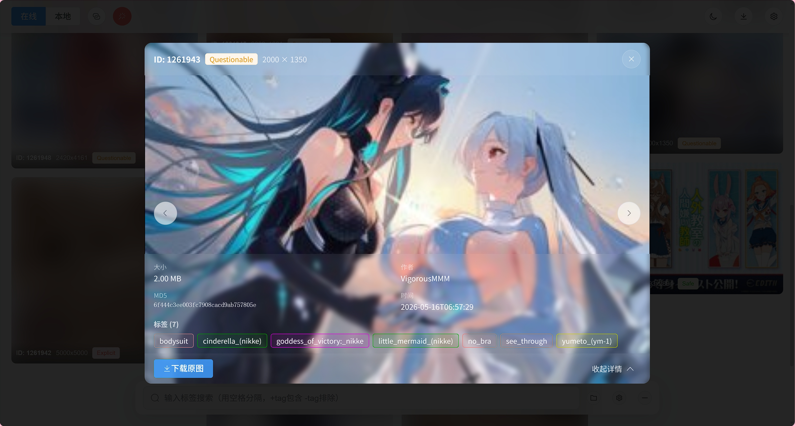 | 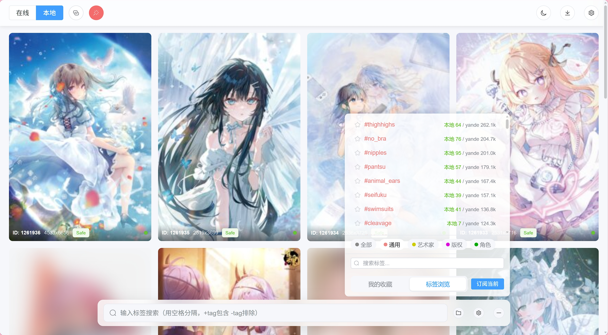 | 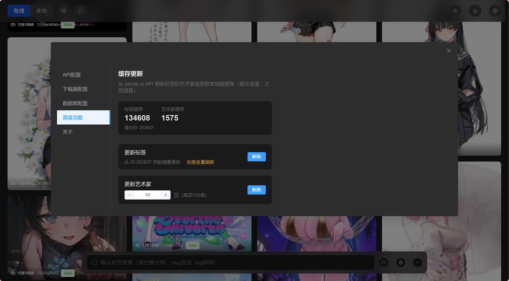 |

| 标签搜索订阅 | 批量下载 | 配置页面 |
|:---:|:---:|:---:|
| 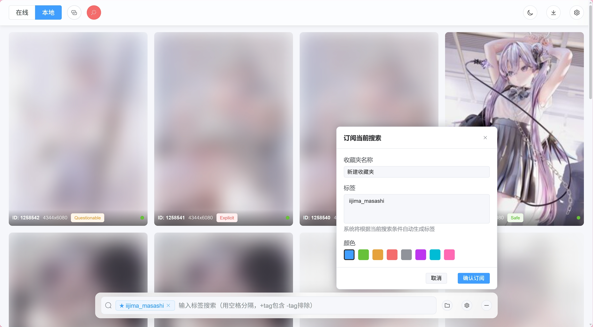 | 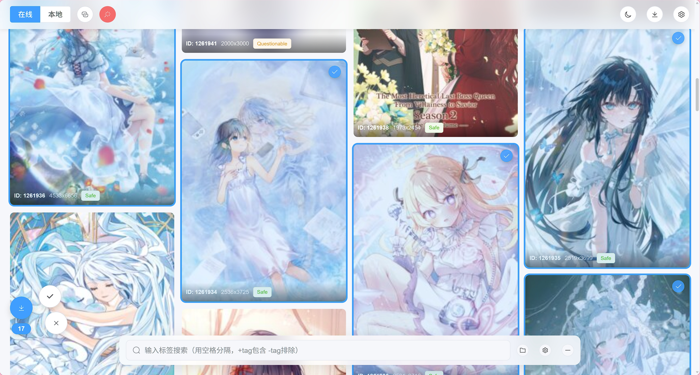 | 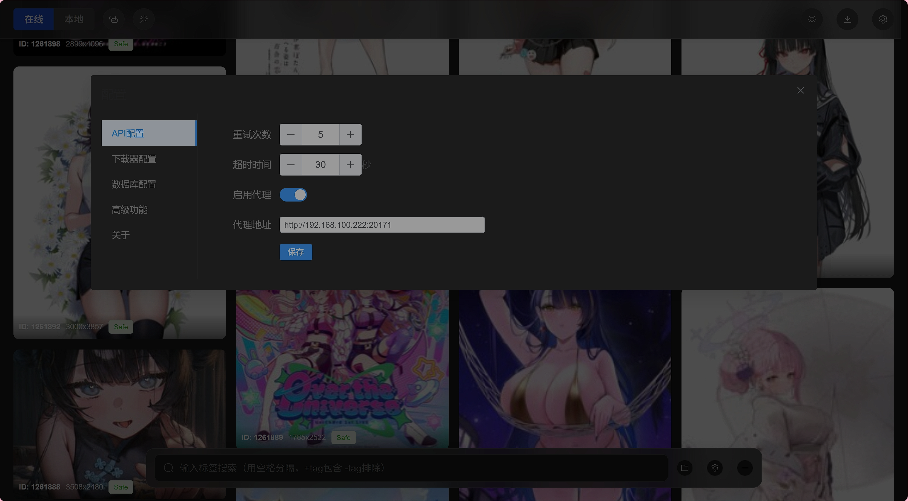 |

| NSFW模式 | 下载管理 | 移动端适配 | 移动端适配 |
|:---:|:---:|:---:|:---:|
|  | 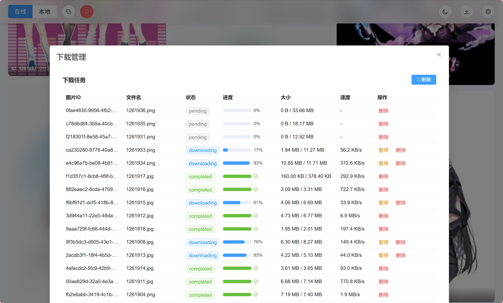 | 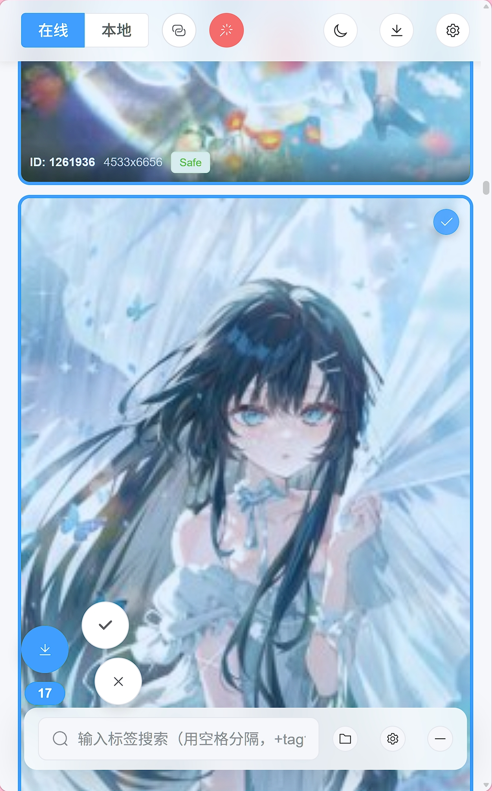 | 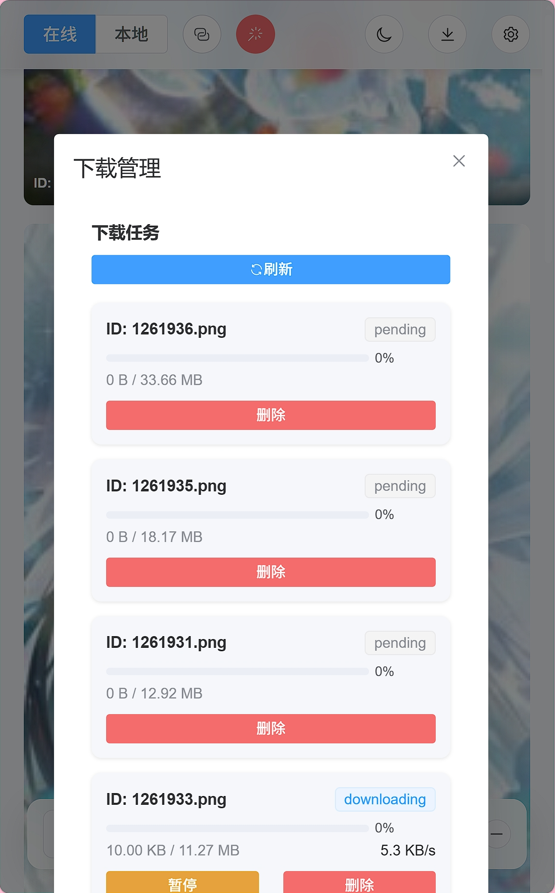 |

</details>

## 主要功能

- ✅ yande.re 图片批量下载（多线程 + 断点续传）
- ✅ 瀑布流图库 + 高级查询（本地 tag 默认精确匹配，`pan*` 前缀通配、`p*n` 中间通配，与 yande.re DSL 一致）
- ✅ 使用docker部署，支持MeriaDB/SQLite
- ✅ NSFW 友好模式，省流模式
- ✅ 数据库缓存，根据tag下载时相同ID不会重复下载
- ✅ 标签收藏夹管理（支持在线/本地数量缓存）
- ✅ 收藏夹定时调度（按 cron 表达式自动拉取新图入下载队列，增量/最大两种模式）

**使用注意**：
- 无法直连yande站时，需要自行准备梯子
- 未对文件名做uuid转换，请勿直接将该服务放至外网


## 快速开始

### 1. 安装依赖

#### 后端依赖
```bash
# 使用 uv 管理依赖（推荐）
uv sync

# 或使用 pip
pip install -e .
```

#### 前端依赖
```bash
cd frontend
npm install
```

### 2. 启动服务

```bash
# 启动后端API服务（在 backend 目录下）
cd backend
uvicorn service:main_app --reload --host 0.0.0.0 --port 8000

# 正式环境部署（去除 --reload）
uvicorn service:main_app --host 0.0.0.0 --port 8000

# 启动前端开发服务器
cd frontend
npm run dev
```

### 3. 访问应用
- 前端界面: http://localhost:3000
- 后端API: http://localhost:8000
- API文档: http://localhost:8000/docs

### 4. Docker 部署

```bash
# 本地开发（自动构建）
docker compose up

# 生产环境（使用预构建镜像）
docker compose -f docker-compose.yml up

# 镜像通过 GitHub Actions 自动构建推送（详见 .github/workflows/docker-build-push.yml）：
# - push 到 next_dev 分支（PR merge） → dev-<sha> + 浮动 dev
# - push 到 next 分支（PR merge）    → rc-<sha>（仅开发验证，无浮动指针）
# - push tag vX.Y.Z                  → X.Y.Z + 浮动 latest
```

## 分支与发布策略

> 代码从开发到上线的完整路径，对应 `.github/workflows/docker-build-push.yml` 的触发器。

### 分支层级

| 分支 | 角色 | 触发 Docker 镜像 |
|------|------|------------------|
| `feature/<name>` | 主开发分支，新功能在此实现 | （本地构建） |
| `next_feature` | 新特性验证专用分支（与 `feature` 区分） | （本地构建） |
| `next_dev` | 多功能集成验证 | `dev-<sha>` + 浮动 `dev` |
| `next` | RC 验证 | `rc-<sha>`（**无浮动指针**） |
| `vX.Y.Z` tag | 正式发布 | `X.Y.Z` + 浮动 `latest` |

### 完整流程

```
feature/<name>  ──┐
feature/<name2> ──┼─→  next_dev  ──→  next  ──→  vX.Y.Z tag  ──→  latest
feature/<name3> ──┘
```

1. 从 `feature` 拉新分支开发，完成后 MR 合入 `next_dev` 集成验证
2. 多个功能在 `next_dev` 验证通过后，`next_dev` 合入 `next` 作为 RC
3. RC 验证通过后，打 `vX.Y.Z` tag 发布为 latest

> **RC 无浮动指针的设计原因**：强制显式选择 SHA，避免自动化脚本误把 RC 镜像拉进生产。`rc-<sha>` 是给测试人员人肉验证用的，不是给自动化用的。

## 数据流程

### 在线模式
1. 用户浏览时，数据自动保存到数据库（down_flag=False）
2. 下载完成后，down_flag 更新为 True
3. 支持按评分、分辨率、格式等条件过滤

### 本地模式
1. 仅显示数据库中 down_flag=True 的记录
2. 从本地文件加载预览图和原图
3. 支持省流模式（不加载预览图）

## 架构设计

详见 [docs/design.md](docs/design.md)

## 重构记录

- [refactor-2026-05-17.md](docs/refactor-2026-05-17.md) - 图片预览优化、后端架构重组、前端交互改进
- [refactor-2026-05-02.md](docs/refactor-2026-05-02.md) - 批量下载、down_flag、YandeApi重试机制等修复
- [refactor-2026-04-28.md](docs/refactor-2026-04-28.md) - 导入路径和常量管理标准化

## 开发计划

### 近期功能
- [x] 本地模式 tag 收藏夹管理
- [x] 本地模式标签搜索强制 AND 逻辑
- [x] 收藏夹在线数量 XML API 获取
- [x] 下载器 MD5 失败只警告
- [x] 下载器断点续传优化
- [_] 本地模式 tag 分组展示
- [ ] 点击详情页中的 tag 快速跳转查询
- [ ] 下载历史在数据库中记录

### 架构优化
- [x] 改为 uv 管理项目依赖
- [x] Docker 多阶段构建优化
- [x] Docker Compose 分离生产/开发配置
- [x] 增加异步定时任务功能（根据 tag 定时启动下载器）
- [ ] 多机部署优化：OBS模式存储，Celery托管下载器/定时任务
- [ ] moebooru like 平台兼容
- [ ] danbooru like 平台兼容

### 图片存储优化
- [ ] 本地图片空间压缩（HEIF/AVIF 格式自动转换）

### 远期计划
- [ ] Electron 桌面客户端
- [ ] 移动端适配优化

### 已知问题
- [ ] 省流模式本地失效
- [ ] 本地tag数量刷新慢

## 许可证

MIT License
